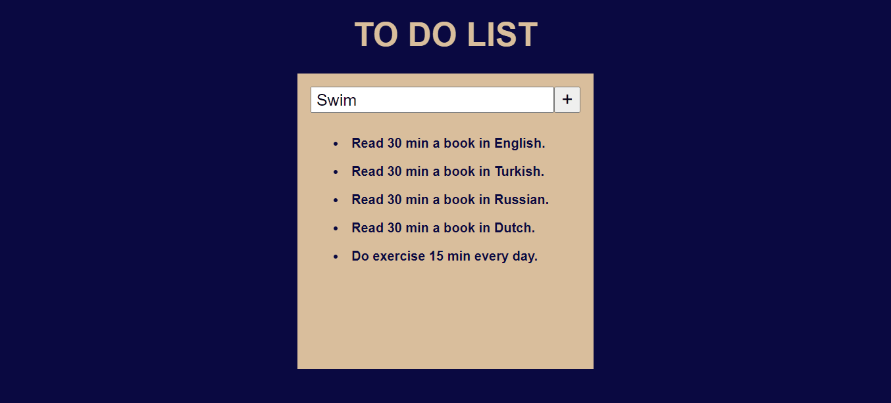

# To_Do_List

<h2>I made this to do list with the help of HTML, CSS and JavaScript.</h2>

<h3>I used <a href="https://cdnjs.com/libraries/font-awesome"><b>Font Awesome</b> </a> (for icons) </h3>

<h3> I used javascript's:

 add.Even.Listener('click', function(){}), 
 
 createElement(), 
 
 classList.add(), 
 
 innerText=;, 
 
 appendChild(), 
 
 removeChild(). </h3>

<h3>Preview:</h3>

Enjoy Coding ❤

